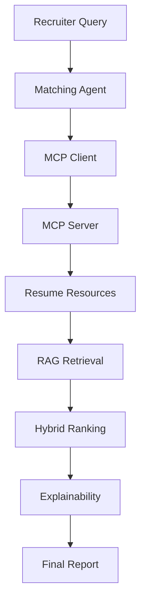
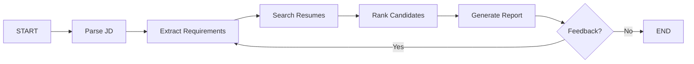
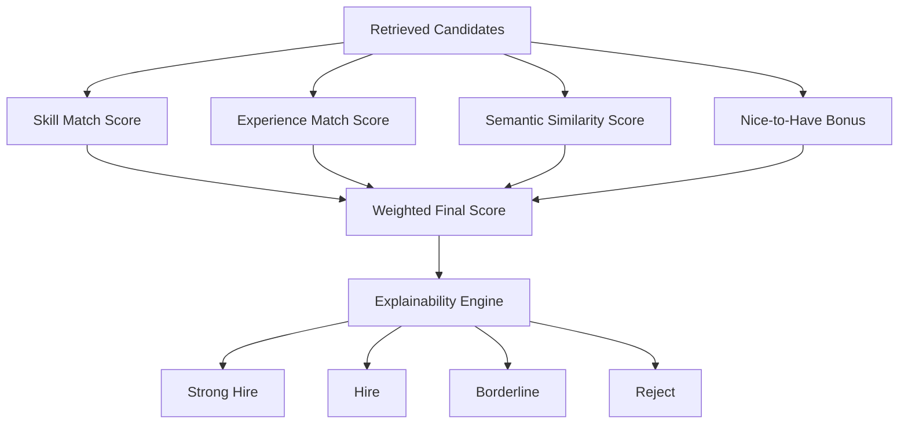
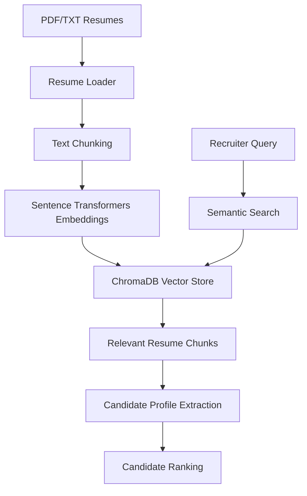
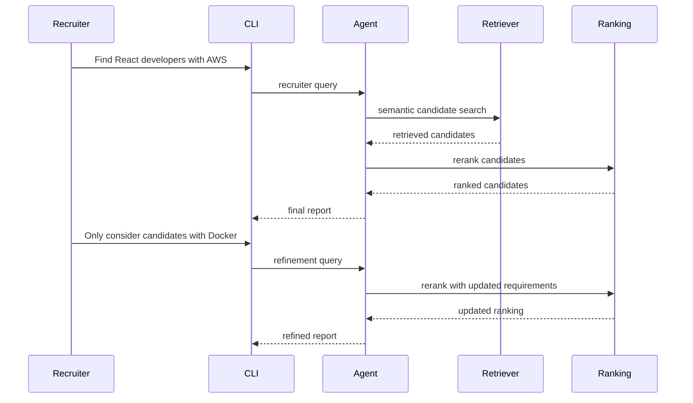

# TalentRankAI

TalentRankAI is a modular AI hiring agent built with Python, LangGraph, OpenRouter, ChromaDB, sentence-transformers, and pypdf. It acts like a lightweight recruiter assistant: it parses job descriptions, extracts requirements, retrieves resumes with RAG, ranks candidates, explains the ranking, compares candidates, and generates interview questions.

## Features

- PDF resume loading from `data/resumes`
- Text chunking and sentence-transformers embeddings
- Persistent ChromaDB vector search
- LLM-based job requirement extraction through OpenRouter
- Hybrid scoring:
  - skill match: 40%
  - experience match: 30%
  - semantic similarity: 20%
  - nice-to-have bonus: 10%
- Missing skill penalties and readable explanations
- LangGraph workflow with a simple feedback refinement loop
- Conversational CLI intents:
  - search candidates
  - refine with constraints
  - compare top candidates
  - explain why one candidate ranked higher
  - generate interview questions
 
### MCP Features
- JSON-RPC 2.0 compliant MCP server
- Filesystem MCP client abstraction
- Resource discovery
- Directory monitoring using watch_directory()
- Batch processing using batch_process()
- MCP-based filesystem access

## Architecture

```text
app/
  agent/      LangGraph workflow, state management, recruiter interface
  mcp/        MCP server, MCP client, JSON-RPC models, resource registry
  rag/        Resume loading, chunking, embeddings, retrieval
  ranking/    Hybrid scoring, reranking, explainability
  tools/      Requirement extraction, comparisons, interview generation
  prompts/    Prompt templates
  utils/      Configuration, OpenRouter wrapper, helpers
```

## MCP Architecture

TalentRankAI uses MCP (Model Context Protocol) to standardize filesystem access.

Instead of directly accessing resume files, the hiring agent communicates through a Filesystem MCP Client which interacts with a Filesystem MCP Server using JSON-RPC 2.0.

### MCP Resources

```text
list_resumes
load_resume
load_all_resumes
list_jds
load_jd
load_all_jds
watch_directory
batch_process
```
## Agent MCP Interaction


The LangGraph flow is:

## LangGraph Workflow


## Hybrid Ranking Pipeline


## Retrieval-Augmented Generation (RAG) Pipeline


## Example Conversational Flow



## Setup

1. Create and activate a virtual environment.

```bash
python -m venv .venv
source .venv/bin/activate
```

2. Install dependencies.

```bash
pip install -r requirements.txt
```

3. Configure OpenRouter.

```bash
cp .env.example .env
```

Set:

```text
OPENROUTER_API_KEY=your_openrouter_api_key_here
OPENROUTER_MODEL=openai/gpt-4o-mini
```

4. Add PDF resumes to:

```text
data/resumes/
```

Or generate sample data:

```bash
python scripts/generate_resumes.py 
python scripts/generate_jds.py 
```

This creates realistic synthetic resumes and job descriptions for testing. 

## Integration Testing

### MCP Validation

```bash
python tests/test_mcp_server.py
python tests/test_mcp_client.py 
```

### Hiring Agent Validation

```bash
python tests/test_loader.py
python tests/test_extraction.py
python tests/test_indexing.py
python tests/test_retrieval.py
python tests/test_ranking.py
python tests/test_agent.py
```

## Technologies Used

- Python
- LangGraph
- OpenRouter
- ChromaDB
- sentence-transformers
- pypdf
- OpenAI SDK
- RAG (Retrieval-Augmented Generation)
- Hybrid ranking architecture
- MCP (Model Context Protocol)
- JSON-RPC 2.0


## Run

From the project directory:

```bash
python cli.py
```

Index resumes first:

```text
Recruiter: index
Agent: Indexed 24 resume chunks.
```

Then search:

```text
Recruiter: Find React developers with 3+ years experience
Agent: Ranked candidates:
1. John Doe - score 0.82 - Strong Hire
   Strengths: Matches required skills: React, Node.js; Meets or exceeds the experience requirement
   Gaps: Missing: AWS
```

Refine the search:

```text
Recruiter: Only consider candidates with AWS
```

Compare candidates:

```text
Recruiter: Compare top 3 candidates
```

Generate questions:

```text
Recruiter: Generate interview questions
```

## Notes

- If `OPENROUTER_API_KEY` is missing, extraction falls back to local heuristic parsing so the project remains runnable.
- The first embedding run may download the sentence-transformers model.
- This project intentionally avoids APIs, authentication, Docker, and microservices.
